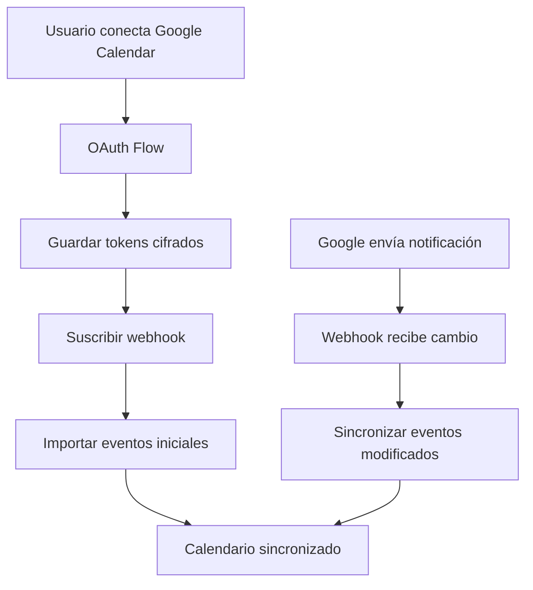

# 🚀 Backend - Calendario Inteligente

Backend API para la aplicación de Calendario Inteligente con OAuth, sincronización de calendarios externos y optimización de agendamiento.

## 📋 Stack Tecnológico

- **Framework**: NestJS 10
- **Base de Datos**: PostgreSQL 15+
- **Cache**: Redis 7+
- **ORM**: TypeORM
- **Autenticación**: Passport.js + JWT
- **OAuth**: Google Calendar, Microsoft Graph, Apple CalDAV
- **Maps**: Google Maps Distance Matrix API
- **Language**: TypeScript 5+

## 🛠️ Instalación

### 1. Prerrequisitos

```bash
# Node.js 18+
node --version

# PostgreSQL 15+
psql --version

# Redis 7+
redis-server --version
```

### 2. Instalar PostgreSQL y Redis (con Docker)

```bash
# Opción A: Docker Compose (recomendado)
cd backend
docker-compose up -d

# Opción B: Instalación local
# macOS
brew install postgresql@15 redis
brew services start postgresql@15
brew services start redis

# Ubuntu/Debian
sudo apt update
sudo apt install postgresql-15 redis-server
sudo systemctl start postgresql
sudo systemctl start redis

# Windows
# Descargar instaladores de:
# https://www.postgresql.org/download/windows/
# https://redis.io/download/
```

### 3. Configurar Base de Datos

```bash
# Crear base de datos
createdb calendario_inteligente

# O con psql
psql -U postgres
CREATE DATABASE calendario_inteligente;
\q

# Ejecutar migraciones (schema)
psql -U postgres -d calendario_inteligente -f ../database-schema.sql
```

### 4. Configurar Proyecto

```bash
cd backend

# Instalar dependencias
npm install

# Copiar archivo de configuración
cp .env.example .env

# Editar .env con tus credenciales
nano .env  # o code .env
```

### 5. Configurar OAuth

#### Google Calendar API

1. Ve a [Google Cloud Console](https://console.cloud.google.com)
2. Crea un nuevo proyecto (o selecciona uno existente)
3. Habilita **Google Calendar API**
4. Ve a **Credentials** → **Create Credentials** → **OAuth 2.0 Client ID**
5. Tipo de aplicación: **Web application**
6. URIs de redireccionamiento autorizados:
   ```
   http://localhost:3000/api/auth/google/callback
   ```
7. Copia el **Client ID** y **Client Secret** a tu `.env`

#### Microsoft Graph API (Outlook)

1. Ve a [Azure Portal](https://portal.azure.com)
2. Navega a **Azure Active Directory** → **App registrations** → **New registration**
3. Nombre: "Calendario Inteligente"
4. Redirect URI: `http://localhost:3000/api/auth/microsoft/callback`
5. API permissions → Add permission → Microsoft Graph → Delegated:
   - `Calendars.Read`
   - `Calendars.ReadWrite`
6. Copia **Application (client) ID** y crea un **Client secret**

#### Apple Calendar (CalDAV)

1. Usuario necesita generar **app-specific password**:
   - https://appleid.apple.com/account/manage
   - Security → App-Specific Passwords
2. No requiere registro de app (usa CalDAV directamente)

### 6. Iniciar el Backend

```bash
# Modo desarrollo (con hot-reload)
npm run start:dev

# Modo producción
npm run build
npm run start:prod
```

El servidor estará disponible en: `http://localhost:3000`

## 📁 Estructura del Proyecto

```
backend/
├── src/
│   ├── main.ts                 # Entry point
│   ├── app.module.ts           # Módulo raíz
│   │
│   ├── auth/                   # Autenticación y OAuth
│   │   ├── auth.module.ts
│   │   ├── auth.controller.ts
│   │   ├── auth.service.ts
│   │   ├── strategies/
│   │   │   ├── google.strategy.ts
│   │   │   ├── microsoft.strategy.ts
│   │   │   └── jwt.strategy.ts
│   │   └── guards/
│   │       └── jwt-auth.guard.ts
│   │
│   ├── users/                  # Gestión de usuarios
│   │   ├── users.module.ts
│   │   ├── users.controller.ts
│   │   ├── users.service.ts
│   │   └── entities/
│   │       └── user.entity.ts
│   │
│   ├── calendar/               # Calendarios externos
│   │   ├── calendar.module.ts
│   │   ├── calendar.controller.ts
│   │   ├── calendar.service.ts
│   │   ├── services/
│   │   │   ├── google-calendar.service.ts
│   │   │   ├── microsoft-calendar.service.ts
│   │   │   └── caldav.service.ts
│   │   └── entities/
│   │       ├── calendar-account.entity.ts
│   │       └── event.entity.ts
│   │
│   ├── tasks/                  # Gestión de tareas
│   │   ├── tasks.module.ts
│   │   ├── tasks.controller.ts
│   │   ├── tasks.service.ts
│   │   └── entities/
│   │       └── task.entity.ts
│   │
│   ├── planning/               # Motor de agendamiento
│   │   ├── planning.module.ts
│   │   ├── planning.controller.ts
│   │   ├── planning.service.ts
│   │   ├── schedulers/
│   │   │   ├── greedy-scheduler.ts
│   │   │   └── or-tools-scheduler.ts  # Opcional
│   │   └── entities/
│   │       └── plan-slot.entity.ts
│   │
│   ├── locations/              # Ubicaciones y mapas
│   │   ├── locations.module.ts
│   │   ├── locations.controller.ts
│   │   ├── locations.service.ts
│   │   ├── services/
│   │   │   ├── geocoding.service.ts
│   │   │   └── distance-matrix.service.ts
│   │   └── entities/
│   │       └── location.entity.ts
│   │
│   ├── webhooks/               # Webhooks de calendarios
│   │   ├── webhooks.module.ts
│   │   ├── webhooks.controller.ts
│   │   └── webhooks.service.ts
│   │
│   ├── common/                 # Utilidades compartidas
│   │   ├── decorators/
│   │   ├── filters/
│   │   ├── interceptors/
│   │   ├── pipes/
│   │   └── guards/
│   │
│   └── config/                 # Configuración
│       ├── database.config.ts
│       ├── redis.config.ts
│       └── oauth.config.ts
│
├── test/                       # Tests E2E
├── .env.example
├── .gitignore
├── nest-cli.json
├── package.json
├── tsconfig.json
└── docker-compose.yml
```

## 🔌 API Endpoints

### Autenticación

```http
POST   /api/auth/register
POST   /api/auth/login
GET    /api/auth/google
GET    /api/auth/google/callback
GET    /api/auth/microsoft
GET    /api/auth/microsoft/callback
POST   /api/auth/refresh
POST   /api/auth/logout
```

### Usuarios

```http
GET    /api/users/me
PATCH  /api/users/me
DELETE /api/users/me
```

### Calendarios

```http
GET    /api/calendar/accounts
POST   /api/calendar/accounts
DELETE /api/calendar/accounts/:id
GET    /api/calendar/events?from=YYYY-MM-DD&to=YYYY-MM-DD
POST   /api/calendar/sync            # Sincronizar todos
POST   /api/calendar/sync/:accountId # Sincronizar uno
POST   /api/calendar/webhook         # Recibir notificaciones
```

### Ubicaciones

```http
GET    /api/locations
POST   /api/locations
GET    /api/locations/:id
PATCH  /api/locations/:id
DELETE /api/locations/:id
POST   /api/locations/geocode
GET    /api/locations/distance?from=:id&to=:id&when=:timestamp
```

### Tareas

```http
GET    /api/tasks
POST   /api/tasks
GET    /api/tasks/:id
PATCH  /api/tasks/:id
DELETE /api/tasks/:id
PATCH  /api/tasks/:id/status
```

### Planificación

```http
POST   /api/planning/generate
GET    /api/planning/suggestions
POST   /api/planning/commit
GET    /api/planning/slots
DELETE /api/planning/slots/:id
```

## 🧪 Testing

```bash
# Unit tests
npm run test

# E2E tests
npm run test:e2e

# Coverage
npm run test:cov
```

## 🔐 Seguridad

### Tokens OAuth

Los tokens se almacenan cifrados en la base de datos usando AES-256:

```typescript
// Ejemplo
const encryptedToken = encrypt(accessToken, process.env.ENCRYPTION_KEY);
```

### Rate Limiting

```typescript
// 100 requests por minuto por IP
@UseGuards(ThrottlerGuard)
@Throttle(100, 60)
```

### Validación de Entrada

```typescript
// Todos los DTOs usan class-validator
export class CreateTaskDto {
  @IsString()
  @IsNotEmpty()
  title: string;

  @IsNumber()
  @Min(0.25)
  duration: number;

  // ...
}
```

## 🚀 Deploy

### Railway (Recomendado)

```bash
# 1. Instalar Railway CLI
npm i -g @railway/cli

# 2. Login
railway login

# 3. Crear proyecto
railway init

# 4. Agregar PostgreSQL y Redis
railway add

# 5. Configurar variables de entorno
railway variables set --env production

# 6. Deploy
railway up
```

### Fly.io

```bash
# 1. Instalar flyctl
curl -L https://fly.io/install.sh | sh

# 2. Login
flyctl auth login

# 3. Inicializar
flyctl launch

# 4. Deploy
flyctl deploy
```

### Docker

```bash
# Build
docker build -t calendario-backend .

# Run
docker run -p 3000:3000 \
  --env-file .env \
  calendario-backend
```

## 📊 Monitoreo

### Sentry (Errores)

```typescript
// src/main.ts
Sentry.init({
  dsn: process.env.SENTRY_DSN,
  environment: process.env.NODE_ENV
});
```

### Logs

```typescript
// Winston logger
this.logger.log('Tarea creada', { taskId: task.id });
this.logger.error('Error en OAuth', { error: error.message });
```

## 🔄 Flujo de Sincronización



## 📝 Variables de Entorno Requeridas

| Variable | Descripción | Ejemplo |
|----------|-------------|---------|
| `DB_HOST` | Host PostgreSQL | `localhost` |
| `DB_PORT` | Puerto PostgreSQL | `5432` |
| `DB_USERNAME` | Usuario DB | `postgres` |
| `DB_PASSWORD` | Password DB | `secreto` |
| `DB_DATABASE` | Nombre DB | `calendario_inteligente` |
| `REDIS_HOST` | Host Redis | `localhost` |
| `JWT_SECRET` | Secret para JWT | `random_string` |
| `GOOGLE_CLIENT_ID` | Google OAuth Client ID | `xxx.apps.googleusercontent.com` |
| `GOOGLE_CLIENT_SECRET` | Google OAuth Secret | `xxx` |
| `GOOGLE_MAPS_API_KEY` | Google Maps API Key | `AIza...` |
| `ENCRYPTION_KEY` | Key para cifrar tokens | `32+ caracteres` |

## 🆘 Troubleshooting

### Error: "Cannot connect to PostgreSQL"
```bash
# Verificar que PostgreSQL esté corriendo
pg_isready

# Verificar credenciales
psql -U postgres -d calendario_inteligente
```

### Error: "Redis connection refused"
```bash
# Verificar que Redis esté corriendo
redis-cli ping
# Debe retornar: PONG
```

### Error: "OAuth redirect_uri_mismatch"
```
Verificar que el redirect URI en Google/Microsoft coincida exactamente con:
http://localhost:3000/api/auth/google/callback
```

## 📚 Documentación Adicional

- [NestJS Docs](https://docs.nestjs.com)
- [TypeORM Docs](https://typeorm.io)
- [Google Calendar API](https://developers.google.com/calendar/api/guides/overview)
- [Microsoft Graph API](https://learn.microsoft.com/en-us/graph/api/resources/calendar)
- [Passport.js](http://www.passportjs.org/)

## 🤝 Contribuir

Ver [CONTRIBUTING.md](../CONTRIBUTING.md) en el repositorio principal.

## 📄 Licencia

MIT License - ver [LICENSE](../LICENSE)
